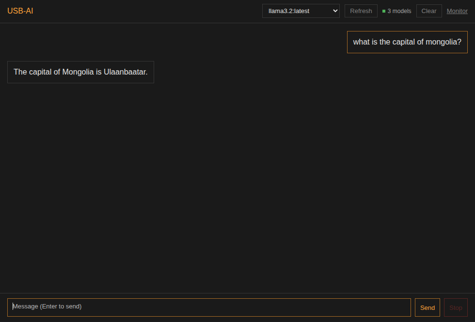

# UI Theme Specifications
## USB-AI Flask + HTMX Chat Interface Theme

This document defines the visual theme for the USB-AI chat interface.



---

## Design Philosophy

Minimal. Dark. Flat. Functional.

No gradients. No shadows. No decorative elements. Content first.

---

## Theme Overview

| Element | Value |
|---------|-------|
| Base Style | Dark flat |
| Reference | Anthropic Claude chat |
| Primary Font | Arial, Helvetica, sans-serif |
| Accent Color | #ffa222 |
| Text Weight | Normal only (no bold) |

---

## Color Palette

### Base Colors

```css
:root {
  --bg-primary: #1a1a1a;
  --bg-secondary: #242424;
  --bg-tertiary: #2d2d2d;
  --bg-input: #333333;
  
  --text-primary: #e5e5e5;
  --text-secondary: #a0a0a0;
  --text-muted: #666666;
  
  --accent: #ffa222;
  --accent-hover: #ffb44d;
  
  --border: #3d3d3d;
  --border-subtle: #2a2a2a;
}
```

### Semantic Colors

```css
:root {
  --success: #4ade80;
  --warning: #ffa222;
  --error: #f87171;
  --info: #60a5fa;
}
```

---

## Typography

### Font Stack

```css
body {
  font-family: Arial, Helvetica, sans-serif;
  font-weight: 400;  /* Normal weight only */
  font-size: 15px;
  line-height: 1.6;
  color: var(--text-primary);
}
```

### Header Hierarchy

No bold. Size differentiation only. Color accent on headers.

```css
h1 {
  font-size: 28px;
  font-weight: 400;
  color: #ffa222;
  margin: 0 0 16px 0;
}

h2 {
  font-size: 22px;
  font-weight: 400;
  color: #ffa222;
  margin: 24px 0 12px 0;
}

h3 {
  font-size: 18px;
  font-weight: 400;
  color: #ffa222;
  margin: 20px 0 10px 0;
}

h4 {
  font-size: 16px;
  font-weight: 400;
  color: #ffa222;
  margin: 16px 0 8px 0;
}
```

---

## List Styling

### Bullet Lists

Accent-colored bullet markers.

```css
ul {
  list-style: none;
  padding-left: 0;
  margin: 12px 0;
}

ul li {
  position: relative;
  padding-left: 20px;
  margin: 6px 0;
}

ul li::before {
  content: "•";
  position: absolute;
  left: 0;
  color: #ffa222;
  font-size: 16px;
}

/* Nested lists */
ul ul li::before {
  content: "◦";
  color: #ffa222;
}

ul ul ul li::before {
  content: "▪";
  color: #ffa222;
}
```

### Numbered Lists

Accent-colored number markers.

```css
ol {
  list-style: none;
  padding-left: 0;
  margin: 12px 0;
  counter-reset: item;
}

ol li {
  position: relative;
  padding-left: 28px;
  margin: 6px 0;
  counter-increment: item;
}

ol li::before {
  content: counter(item) ".";
  position: absolute;
  left: 0;
  color: #ffa222;
  font-size: 15px;
  min-width: 20px;
}

/* Nested numbered lists */
ol ol {
  counter-reset: subitem;
}

ol ol li {
  counter-increment: subitem;
}

ol ol li::before {
  content: counter(subitem, lower-alpha) ".";
  color: #ffa222;
}
```

---

## Message Bubbles

### User Message

```css
.message-user {
  background: var(--bg-tertiary);
  border: 1px solid var(--border-subtle);
  border-radius: 8px;
  padding: 12px 16px;
  margin: 8px 0;
  max-width: 85%;
  margin-left: auto;
}
```

### Assistant Message

```css
.message-assistant {
  background: var(--bg-secondary);
  border: none;
  border-radius: 8px;
  padding: 12px 16px;
  margin: 8px 0;
  max-width: 85%;
}
```

---

## Input Area

```css
.chat-input {
  background: var(--bg-input);
  border: 1px solid var(--border);
  border-radius: 8px;
  padding: 12px 16px;
  color: var(--text-primary);
  font-family: Arial, Helvetica, sans-serif;
  font-size: 15px;
  font-weight: 400;
  resize: none;
}

.chat-input:focus {
  outline: none;
  border-color: #ffa222;
}

.chat-input::placeholder {
  color: var(--text-muted);
}
```

---

## Buttons

```css
.btn-primary {
  background: #ffa222;
  color: #1a1a1a;
  border: none;
  border-radius: 6px;
  padding: 10px 20px;
  font-family: Arial, Helvetica, sans-serif;
  font-size: 14px;
  font-weight: 400;
  cursor: pointer;
  transition: background 0.15s ease;
}

.btn-primary:hover {
  background: #ffb44d;
}

.btn-secondary {
  background: transparent;
  color: var(--text-primary);
  border: 1px solid var(--border);
  border-radius: 6px;
  padding: 10px 20px;
  font-family: Arial, Helvetica, sans-serif;
  font-size: 14px;
  font-weight: 400;
  cursor: pointer;
}

.btn-secondary:hover {
  border-color: #ffa222;
  color: #ffa222;
}
```

---

## Sidebar

```css
.sidebar {
  background: var(--bg-primary);
  border-right: 1px solid var(--border-subtle);
  width: 260px;
  padding: 16px;
}

.sidebar-item {
  padding: 10px 12px;
  border-radius: 6px;
  color: var(--text-secondary);
  cursor: pointer;
  margin: 2px 0;
}

.sidebar-item:hover {
  background: var(--bg-secondary);
  color: var(--text-primary);
}

.sidebar-item.active {
  background: var(--bg-tertiary);
  color: #ffa222;
}
```

---

## Code Blocks

```css
pre {
  background: #0d0d0d;
  border: 1px solid var(--border-subtle);
  border-radius: 6px;
  padding: 16px;
  overflow-x: auto;
  margin: 12px 0;
}

code {
  font-family: 'SF Mono', Monaco, 'Courier New', monospace;
  font-size: 13px;
  color: var(--text-primary);
}

/* Inline code */
p code, li code {
  background: var(--bg-tertiary);
  padding: 2px 6px;
  border-radius: 4px;
  font-size: 13px;
}
```

---

## Model Selector

```css
.model-selector {
  background: var(--bg-input);
  border: 1px solid var(--border);
  border-radius: 6px;
  padding: 8px 12px;
  color: var(--text-primary);
  font-family: Arial, Helvetica, sans-serif;
  font-size: 14px;
}

.model-selector:focus {
  outline: none;
  border-color: #ffa222;
}
```

---

## Scrollbar

```css
::-webkit-scrollbar {
  width: 8px;
  height: 8px;
}

::-webkit-scrollbar-track {
  background: var(--bg-primary);
}

::-webkit-scrollbar-thumb {
  background: var(--border);
  border-radius: 4px;
}

::-webkit-scrollbar-thumb:hover {
  background: #ffa222;
}
```

---

## Complete Theme CSS

Save as `custom-theme.css` for Flask chat UI:

```css
/* USB-AI Dark Flat Theme */
/* Version: 1.0.0 */

:root {
  --bg-primary: #1a1a1a;
  --bg-secondary: #242424;
  --bg-tertiary: #2d2d2d;
  --bg-input: #333333;
  --text-primary: #e5e5e5;
  --text-secondary: #a0a0a0;
  --text-muted: #666666;
  --accent: #ffa222;
  --border: #3d3d3d;
  --border-subtle: #2a2a2a;
}

* {
  font-weight: 400 !important;
}

body {
  font-family: Arial, Helvetica, sans-serif !important;
  background: var(--bg-primary) !important;
  color: var(--text-primary) !important;
}

h1, h2, h3, h4, h5, h6 {
  color: #ffa222 !important;
  font-weight: 400 !important;
}

ul li::marker,
ol li::marker {
  color: #ffa222 !important;
}

strong, b {
  font-weight: 400 !important;
}
```

---

## Implementation

### Flask Chat UI Integration

The theme CSS is embedded directly in the chat_ui.py file.
To modify, edit the CUSTOM_CSS variable in:

```
modules/webui-portable/chat_ui.py
```

### Standalone CSS File

For reference, a standalone CSS file is at:

```
modules/webui-portable/static/css/custom-theme.css
```

---

## Design Rules Summary

| Rule | Specification |
|------|---------------|
| Bold text | Never. Use size only. |
| Header color | #ffa222 |
| List markers | #ffa222 |
| Primary font | Arial, Helvetica |
| Background | Dark (#1a1a1a base) |
| Borders | Subtle, minimal |
| Shadows | None |
| Gradients | None |
| Animations | Minimal, functional only |

---

**Theme designed for readability and reduced eye strain during extended use.**
